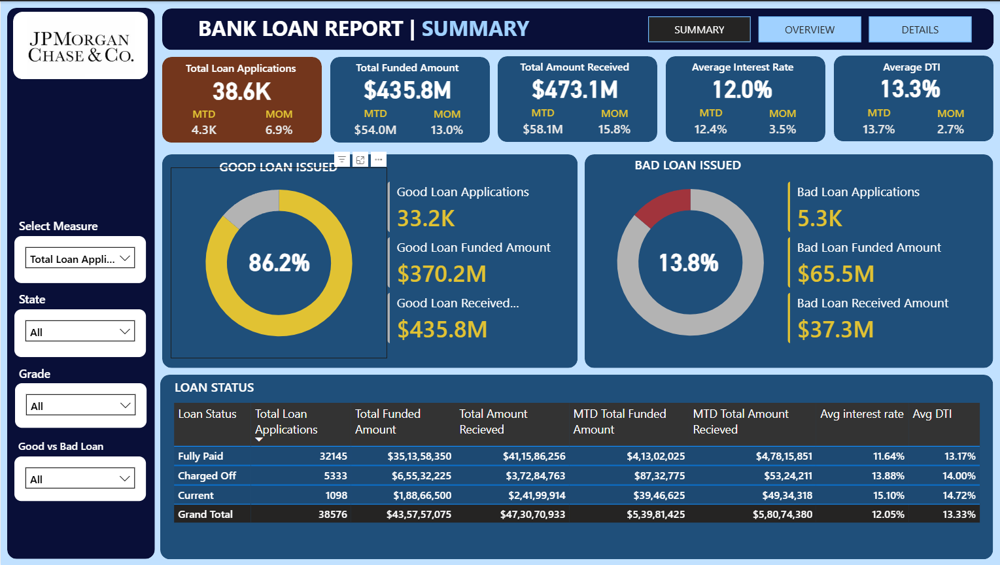
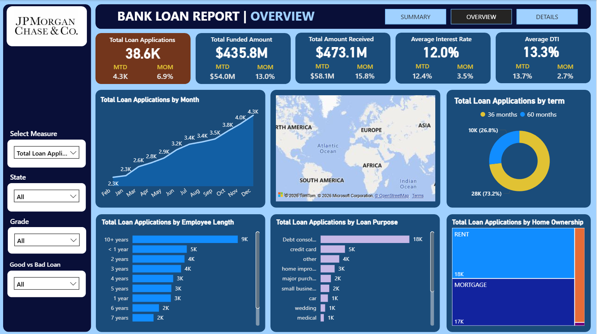
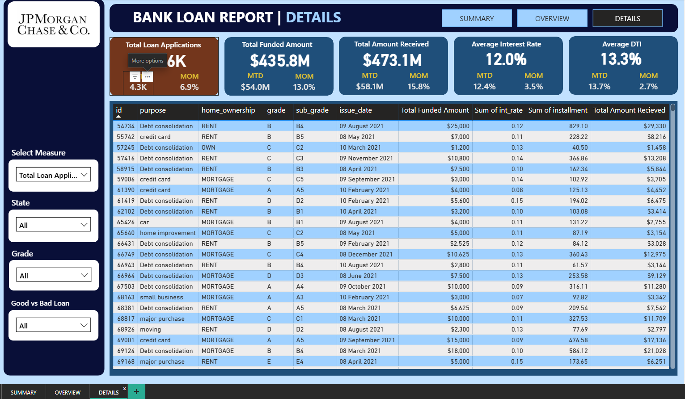

<!DOCTYPE html>
<html>

<body>

<h1>🏦 JPMorgan Bank Loan Report</h1>

<h2>📌 Project Overview</h2>

This project focuses on analyzing bank loan data to monitor <b>lending performance</b>, evaluate <b>portfolio health</b>, 
and generate <b>data-driven insights</b>. The dashboard enables financial institutions to make informed decisions 
by providing a complete view of loan distribution, repayment behavior, and customer risk segmentation.

<h2>🎯 Objective</h2>
<ul>
  <li>Analyze loan application trends and growth</li>
  <li>Track funded vs received amounts</li>
  <li>Identify high-risk loan segments</li>
  <li>Understand borrower behavior</li>
  <li>Enable data-driven decision-making</li>
</ul>

<h2>🛠️ Tools & Technologies</h2>

<h2>📊 Dashboard Explanation</h2>

<h3>🔹 Summary Dashboard</h3>
<ul>
  <li>Total Loan Applications with MTD & MoM growth</li>
  <li>Total Funded Amount & Total Amount Received</li>
  <li>Average Interest Rate & Average DTI</li>
  <li>Good vs Bad Loan segmentation</li>
</ul>

<h3>🔹 Overview Dashboard</h3>
<ul>
  <li>Monthly Loan Trends</li>
  <li>Regional Loan Distribution (Map)</li>
  <li>Loan Term Analysis (36 vs 60 months)</li>
  <li>Employment Length Impact</li>
  <li>Loan Purpose Breakdown</li>
  <li>Home Ownership Distribution</li>
</ul>

<h3>🔹 Details Dashboard</h3>
<ul>
  <li>Loan-level granular data</li>
  <li>Borrower profiles</li>
  <li>Interest rate & installment analysis</li>
  <li>Loan status tracking</li>
</ul>

<h2>🖼️ Dashboard Preview</h2>

<h3>Summary Dashboard</h3>

<h3>Overview Dashboard</h3>

<h3>Details Dashboard</h3>

<h2>🔍 Key Insights</h2>

<ul>
  <li><b>Strong Growth:</b> Loan applications are steadily increasing with positive MoM growth.</li>
  <li><b>Higher Funding Growth:</b> Funded amount is growing faster than applications, indicating larger loans per customer.</li>
  <li><b>Profitability:</b> Total amount received is higher than funded amount, showing strong revenue generation.</li>
  <li><b>Good Loans Dominance:</b> 86.2% of loans are performing well.</li>
  <li><b>Bad Loan Risk:</b> 13.8% of loans contribute significantly to losses.</li>
  <li><b>Debt Consolidation:</b> Most common loan purpose, indicating financial stress among borrowers.</li>
  <li><b>Long-Term Loans:</b> Majority are 60-month loans, increasing risk exposure.</li>
  <li><b>DTI Impact:</b> Higher DTI correlates with higher default probability.</li>
  <li><b>Interest Rate Insight:</b> Higher rates do not fully mitigate default risk.</li>
</ul>

<h2>📌 Conclusion</h2>

The analysis highlights that the bank is experiencing <b>strong growth and profitability</b>, supported by a high proportion 
of good loans. However, the presence of bad loans, although smaller in percentage, contributes significantly to financial losses. 
This indicates a need for improved risk management strategies.

Key recommendations:
<ul>
  <li>Enhance credit evaluation for high DTI customers</li>
  <li>Monitor debt consolidation loans closely</li>
  <li>Optimize long-term loan approvals</li>
  <li>Implement predictive models for default detection</li>
</ul>

<h2>📂 Project Structure</h2>

<h2>👨‍💻 Author</h2>

<b>Kuldeep Rathore</b>

🔗 LinkedIn: 
<a href="https://www.linkedin.com/in/kuldeeprathore9440/" target="_blank">
https://www.linkedin.com/in/kuldeeprathore9440/
</a>

<h2>⭐ Support</h2>

If you like this project, give it a ⭐ on GitHub!

</body>
</html>
